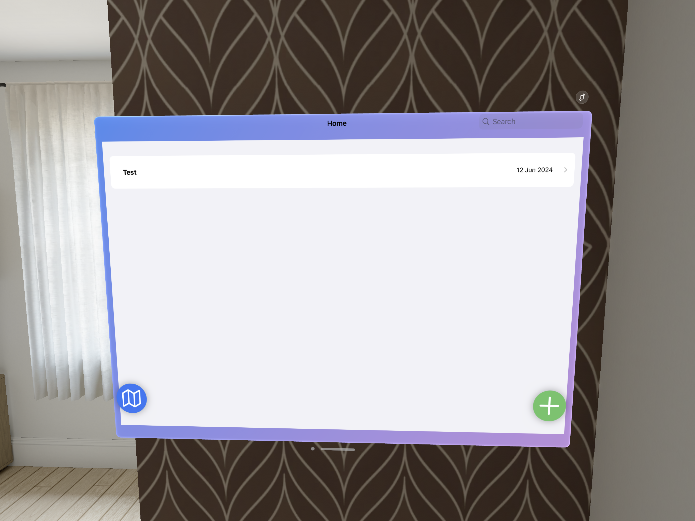
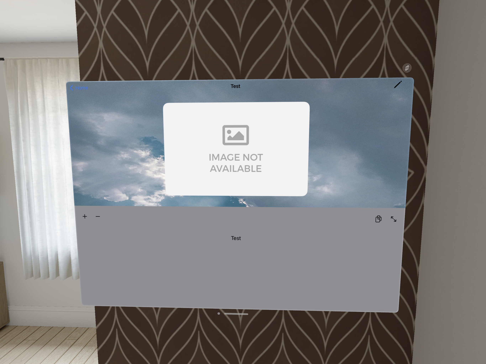
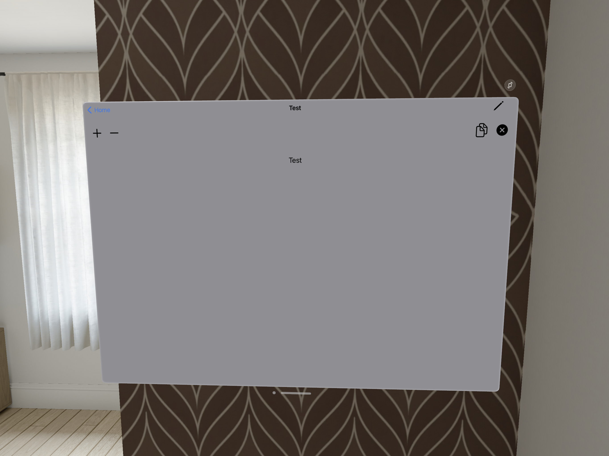
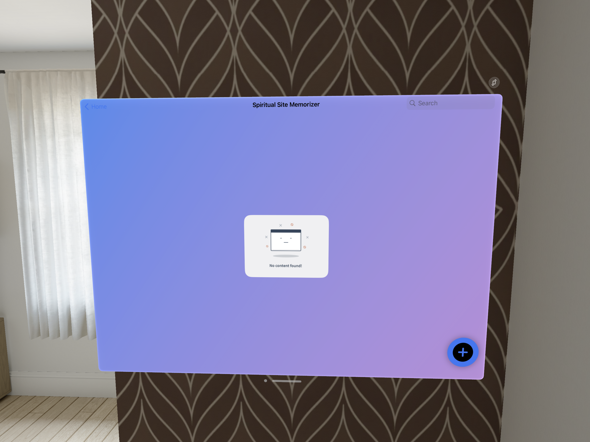
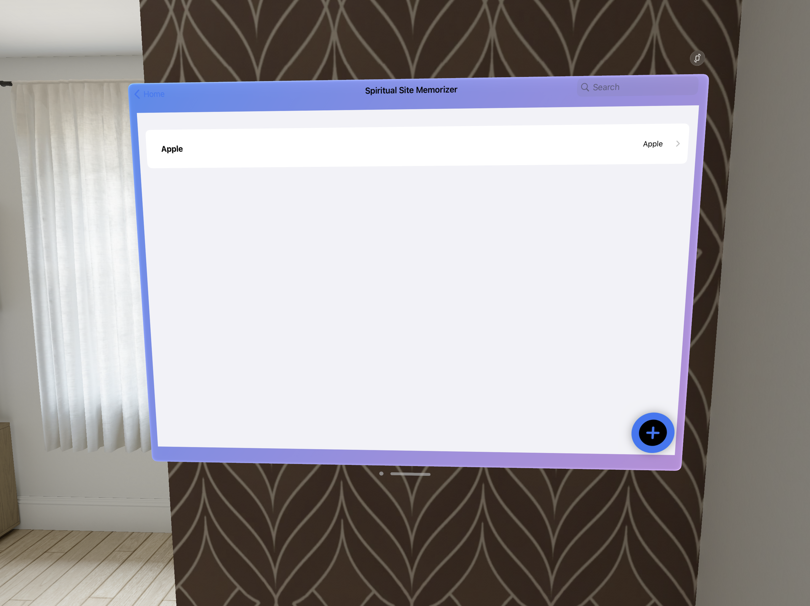
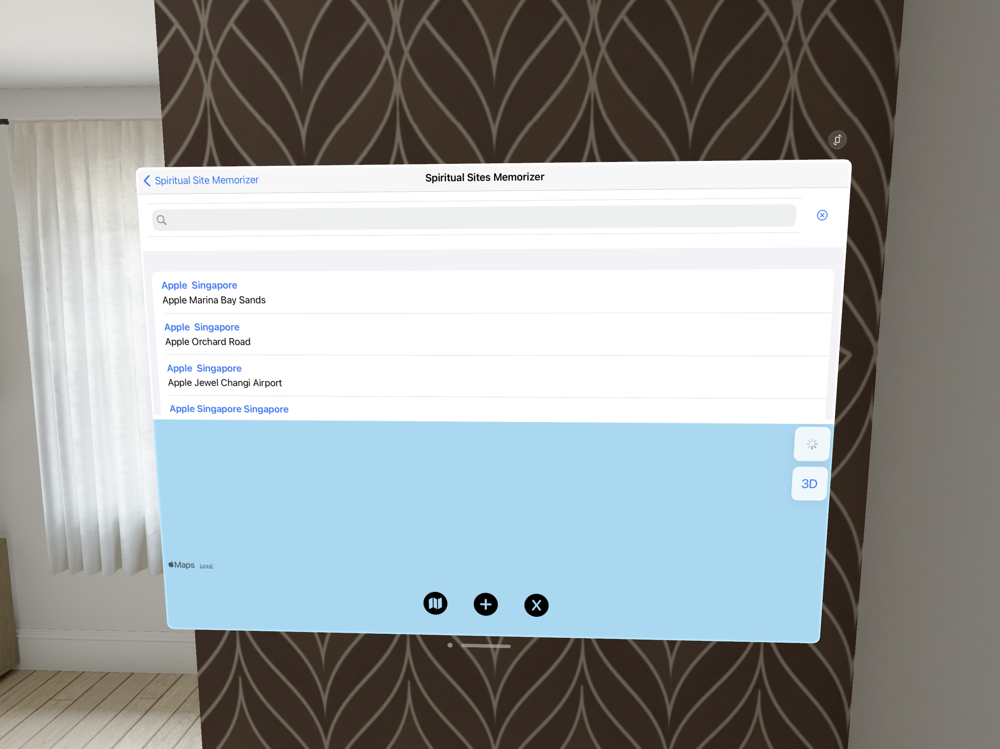

# Pray-Book-Apple-VisionOS
#### 01. Brief Description of Project - 
Prayer book offers the users to save and maintain the prayers in their phone in one app and also save locations of several spiritual places . There by when the user wants to read a prayer any where  or share it it is available at the palm of their hand. Moreover even the spiritual location they might need to visit later would also stored in this app. The uniqueness of this app compare to the others in the appstore is that this app created to fit with any religion in mind, allow users to create thier own prayers and give them easy readability. All in one app have the location of spiritual places and prayers store. Building community has well by sharing prayers and locations of spiritual places.
#### 02. Users of the System - 
Worshipers
#### 03. What is unique about your solution -
The uniqueness of this app compare to the others in the appstore is that this app created to fit with any religion in mind, allow users to create thier own prayers and give them easy readability. All in one app have the location of spiritual places and prayers store. Building community has well by sharing prayers and locations of spiritual places.
#### 04. Briefly document the functionality of the screens you have (Include screen shots of images)
 The first screen of the Vision OS App 

  

 The add prayer screen of the Vision OS App 

  

 The view one prayer screen of the Vision OS App 

  

The view one expanded prayer screen of the Vision OS App 

  

The view SpiritualSiteMemorizer screen of the Vision OS App 

  

The view SpiritualSiteMemorizer screen of the Vision OS App (with content)

  

The view searching location screen of the Vision OS App 

  

The view searching location screen of the Vision OS App 

  

The view searching location screen of the Vision OS App 

  

The view searching location screen of the Vision OS App 

  

#### 05. Documentation 

(a) Design Choices
1. A floating button was added for easy navigation
2. The size of the button had been increased
3. Added a gradient background
4. Added padding among search
   
(b) Why would someone want to invest on your project idea
1. Unique solution which caters to a wider market.

(c) Further enhancements you propose
1. For the vision pro the ui needs to be more customised

(d) How would you commercialize this product
1. It would be totally free

#### 06. Reflection

1. Challenges that you faced in doing this part of the assingment (other than know technical issues of getting hold of a proper Mac machine).
How would have approached this Assignment differently.
There werent much of a challenge in completing this assignment. I already got the taste of swiftui from the labs and my development experience based on other languages.
